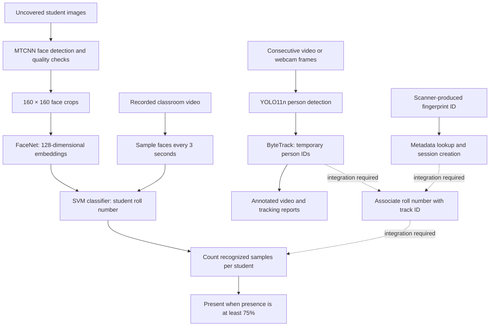

# SmartPresence

SmartPresence is a hybrid attendance research project combining face recognition, person tracking, fingerprint identity lookup, and presence-based attendance. Permanent student identity is a `roll_number`; a body-tracking `track_id` is temporary and does not identify a student by itself.

The repository currently provides working face-recognition tests and an independent **YOLO11n + ByteTrack** body-tracking workflow. Fingerprint/session and track-to-student mapping utilities are present, but automatic fingerprint-to-track association and a unified attendance pipeline are not yet connected.

## How the system works



Face recognition answers **who is visible** among enrolled uncovered students. Body tracking answers **which detected person continues across frames**, including people whose faces are covered. Fingerprint lookup supplies a permanent identity for the intended covered-student workflow; it does not perform biometric matching itself.

## Dataset and provenance

The student dataset was reorganized from `Data1.zip`. Rolls `22102001`–`22102040` were assigned sequentially using the original archive folder-entry order; original folder names should not be treated as the final roll mapping. See [student_folder_mapping.csv](dataset/metadata/student_folder_mapping.csv) for the authoritative source-folder mapping.

The recorded local preprocessing snapshot is:

| Group | Students | Raw images | Accepted face crops | Rejected images |
|---|---:|---:|---:|---:|
| Uncovered | 36 | 6,664 | 5,737 | 927 |
| Covered | 4 | 800 | 0 | 0 |
| Total | 40 | 7,464 | 5,737 | 927 |

The covered rolls are **22102002, 22102030, 22102031, and 22102033**, with 200 raw images each. Their images are preserved and skipped during face preprocessing, so they are neither accepted face crops nor rejections. They are absent from the saved face classifier. The body-tracking module loads pretrained YOLO weights; it does not train on these covered-student images.

Uncovered classes are imbalanced: accepted images range from 47 to 341 per student. The preprocessing report records no duplication or augmentation. Counts are documented in [dataset_summary.csv](dataset/metadata/dataset_summary.csv) and [preprocessing_report.md](outputs/reports/preprocessing_report.md); scripts discover images dynamically rather than assuming equal class sizes.

```text
dataset/
  raw/uncovered/<roll_number>/    Original uncovered images
  raw/covered/<roll_number>/      Preserved covered images
  processed/<roll_number>/       Accepted 160 × 160 face crops
  rejected/                      Failed preprocessing samples
  metadata/                      Student records and processing manifests
  test_images/single/             Inputs for numbered image-test scripts
  test_images/group/
  test_videos/
test_data/
  images/single/                  Local trained-model test inputs
  images/group/
  videos/                        Face-recognition video tests
    body_tracking/               Independent person-tracking video tests
```

Raw image names follow `<roll_number>_face_<three-digit serial>.<original_extension>`. Important metadata files include:

- `students.csv`: permanent roll number, display name, face status, fingerprint ID, dataset folder, and active state.
- `student_folder_mapping.csv`: original folder, assigned roll, and source image count.
- `face_visibility.csv`: face visibility metadata.
- `processed_images.csv` and `rejected_images.csv`: per-image processing records, including orientation recovery or rejection details.
- `dataset_summary.csv` and `preprocessing_summary.csv`: dataset and preprocessing summaries.

### Saved classifier snapshot

[model_info.json](models/classifiers/model_info.json) describes a separate Colab run dated September 3, 2026: **6,901 successful embeddings across 36 students**, split into 5,520 training and 1,381 test samples, with a 20% test split and random seed 42. The saved classifier uses a `Normalizer + SVC` pipeline with an RBF kernel, `C=10`, `gamma=scale`, and balanced class weights.

That run reports **99.49% held-out accuracy** and **99.36% macro F1**. These are saved face-classification results, not measured tracking or end-to-end attendance accuracy. Its 6,901-image manifest differs from the local 5,737-crop preprocessing snapshot; the artifacts do not establish that these are the same dataset version. Preserve the run's dataset hash and provenance when comparing results.

## Components and technologies

| Component | Technology | Purpose |
|---|---|---|
| Face detection | MTCNN | Locate faces; local inference also uses alignment |
| Face embeddings | DeepFace `Facenet`, TensorFlow / tf-keras | Convert faces into 128-dimensional feature vectors |
| Identity classification | scikit-learn SVM and label encoder | Predict enrolled student roll numbers |
| Person detection | Ultralytics YOLO11n, `models/tracking/yolo11n.pt` | Detect COCO person class 0 |
| Person tracking | ByteTrack, `bytetrack.yaml` | Maintain temporary IDs across consecutive frames |
| Video and image processing | OpenCV, Pillow | Decode video, crop/resize images, draw and save results |
| Data and reports | NumPy, pandas, CSV/JSON, Matplotlib | Store observations, calculate attendance, plot results |
| Configuration and artifacts | PyYAML, joblib/pickle | Load settings and saved models |
| Fingerprint identity | CSV-backed lookup utilities | Resolve scanner-produced IDs to active students |

### Face preprocessing and recognition

1. Read uncovered raw images and student metadata. Skip covered students.
2. Detect faces using full-resolution RGB MTCNN input with a 0.90 confidence threshold, minimum 40 × 40 face size, and a 20% crop margin.
3. Apply configured blur, brightness, and multiple-face checks. Try the recorded 90° orientation fallback where applicable.
4. Resize accepted crops to 160 × 160 using aspect-preserving letterboxing; preserve rejected images and write manifests.
5. Extract FaceNet embeddings, train an SVM, and evaluate a held-out split.
6. For local inference, use aligned MTCNN detections and DeepFace `Facenet` normalization. The recognizer avoids applying embedding normalization twice when the saved pipeline already contains a `Normalizer`.
7. Return `Unknown` when the highest classifier probability is below **0.55**; otherwise return the decoded roll and confidence.

The current preprocessing report records 640 no-face failures, 255 low-confidence detections, 31 undersized faces, and one ambiguous multi-face image. The orientation fallback recovered 68 images.

**Training paths differ:** `scripts/03_train_model.py` currently trains a plain SVC using `RECOGNITION.svm_kernel: linear`, whereas the imported Colab artifact uses the normalized RBF pipeline described above. The generic embedding adapter also does not explicitly select the local inference path's `Facenet` normalization. Running the numbered training scripts overwrites classifier artifacts and is not an exact reproduction of the imported model; align preprocessing, normalization, and classifier settings before comparing runs.

### YOLO11n + ByteTrack body tracking

`src/tracking/person_tracker.py` loads YOLO11n and calls Ultralytics tracking with `persist=True`, ByteTrack, person class `0`, confidence `0.40`, and inference size `640`. Every consecutive frame is processed; the face-recognition 3-second/180-second sampling intervals do not apply to this tracker. Tracker state is reset between videos.

Each observation contains a temporary `track_id`, detection confidence, and an `(x1, y1, x2, y2)` bounding box. The video runner saves:

- `outputs/tracking/videos/<video>_tracked.mp4`: annotated video with IDs and confidence.
- `outputs/tracking/frames/`: first, middle, and final tracked-frame examples when available.
- `outputs/tracking/reports/<video>_tracking_log.csv`: video name, frame, timestamp, ID, confidence, and box coordinates.
- `outputs/tracking/reports/<video>_track_summary.csv`: first/last frame, visible-frame count, first/last time, and approximate visible duration (`frames_visible / FPS`).

Visible duration counts detected frames; it is not the complete elapsed span between first and last sightings. IDs can change or switch after occlusion or re-entry and are not permanent or cross-camera identities. The webcam command currently provides a live preview without the recorded-video reports.

The older `CoveredFaceTracker` remains an **OpenCV HOG + centroid matching baseline**, used by `scripts/09_run_covered_face_tracking.py`. It is separate from the new YOLO/ByteTrack runner.

### Fingerprint, sessions, and identity association

`FingerprintDatabase` validates the static `fingerprint_database.csv` against authoritative `students.csv` metadata. `verify_fingerprint()` returns a structured identity with a `verified` flag, or a failure reason. Unknown IDs and inactive records cannot create sessions through the demo. Fingerprint template IDs are simulated labels; no templates enter FaceNet or YOLO.

`start_session()` creates a UUID and appends an entry record to `attendance_logs/session_records.csv`; `record_exit()` appends an exit record. `IdentityMapper.associate()` can hold a mapping of track ID to roll number, session, entry time, and face status in memory. Selecting the correct person at entry, persisting/recovering that mapping, and handling lost or switched tracks still require integration.

Despite its name, `scripts/10_run_full_system.py` currently performs only fingerprint-ID lookup and session creation. It does not launch recognition, tracking, or final attendance calculation.

### Static Fingerprint Demonstration

Fingerprint IDs `FP001`–`FP040` simulate successful scanner-produced IDs, each deterministically mapped to one enrolled student. The 40 records in `dataset/metadata/fingerprint_database.csv` are generated from `students.csv`, with template labels `T001`–`T040` and simulated finger `right_index`. The database validates the exact identity ranges, unique IDs, statuses, and face-status agreement before lookup. Input is trimmed and converted to uppercase.

This **simulated fingerprint verification** demonstrates identity association and informational routing only. No fingerprint image matching is performed; hardware biometric acquisition is outside this prototype stage. It does not measure fingerprint recognition performance or launch either vision branch.

```text
FP030 → 22102030 → Covered   → YOLO + ByteTrack
FP017 → 22102017 → Uncovered → FaceNet + SVM
```

```bash
# Interactive demo:
python scripts/test_static_fingerprint.py
# Direct lookup (no session is created by default):
python scripts/test_static_fingerprint.py FP030
# Optionally append a session using the existing session manager:
python scripts/test_static_fingerprint.py FP030 --create-session
# Failure example:
python scripts/test_static_fingerprint.py FP999
```

Unknown and empty IDs return `NOT VERIFIED`; inactive records return `Student fingerprint record is inactive`. Neither creates a session. Exit codes are 0 for verified, 1 for unsuccessful verification/cancellation, and 2 for configuration or file errors. Session creation appends to `attendance_logs/session_records.csv` and preserves existing entries.

To explicitly regenerate the static mapping after an authoritative metadata change (this replaces the generated CSV):

```bash
python -c "from src.fingerprint.fingerprint_database import generate_fingerprint_database; generate_fingerprint_database()"
```

### Attendance calculation

The face-video test computes:

```text
presence percentage = recognized sampled frames / total scheduled sampled frames × 100
Present if presence percentage >= 75%; otherwise Absent
```

For example, 15 recognized samples out of 20 gives 75% and is marked Present. A student is counted at most once per sample, even if duplicate face predictions appear. Unknown predictions do not count. Failed frame reads still remain in the scheduled-sample denominator.

`scripts/test_video.py` samples every 3 seconds and writes `outputs/attendance/frame_presence_log.csv`, `final_attendance.csv`, and presence charts, plus marked videos in `outputs/videos/`. The output video repeats annotated sampled frames between sampling points. Its report includes all 40 rolls, but covered students cannot be recognized by the 36-class model and therefore receive no face-based presence credit. This report is not yet a combined covered/uncovered attendance result.

The separate session-based calculator groups `attendance_logs/presence_log.csv` by session and roll, divides the sum of `observed` by the number of logged rows, and writes `attendance_logs/final_attendance.csv`. Its `presence_percentage` field is a fraction from 0 to 1. Callers must log both observed and unobserved opportunities for a meaningful denominator; logging only positive sightings yields 100%. The body tracker does not automatically populate this log.

## Installation and running

Run commands from the project root:

```bash
python -m venv .venv
source .venv/bin/activate
pip install -r requirements.txt
```

Requirements include `scikit-learn==1.6.1` for the saved classifier. Model loading may need network access if required pretrained assets are not already cached. Use `--no-preview` for recorded body-tracking runs without a graphical display.

### Test the existing face model

Place inputs in the corresponding `test_data/` directories shown above, then run:

```bash
python scripts/check_model.py
python scripts/test_single_image.py
python scripts/test_group_image.py
python scripts/test_video.py
```

Image tests save annotated results and CSV reports under `outputs/`; `outputs/reports/test_config.json` records inference settings.

### Test body tracking

Place `.mp4`, `.avi`, `.mov`, or `.mkv` files in `test_data/videos/body_tracking/`:

```bash
python scripts/08_test_body_tracking.py --no-preview
# Show the recorded-video preview; press Q to stop:
python scripts/08_test_body_tracking.py --preview
# Live webcam preview:
python scripts/08_test_body_tracking.py --camera --camera-index 0
```

### Run preprocessing and research training

These commands generate or replace model artifacts; preserve existing models and completed experiment results first. Review the training-path differences above before retraining.

```bash
python scripts/01_preprocess_dataset.py
python scripts/02_extract_embeddings.py
python scripts/03_train_model.py
python scripts/04_evaluate_model.py
```

Preprocessing writes its report before embedding extraction. Training saves embeddings/classifier-related artifacts under `models/`, including a held-out evaluation split; evaluation uses that saved split without retraining. Keep completed experiment directories and create a new named experiment for each comparison.

### Supporting entry points

```bash
python scripts/05_test_single_image.py dataset/test_images/single/example.jpg
python scripts/06_test_group_image.py dataset/test_images/group/example.jpg
# Frame-sampling demonstration only; its callback does not run recognition:
python scripts/07_test_video.py dataset/test_videos/classroom.mp4 --mode experiment
# Calculate attendance from an already-populated session presence log:
python scripts/08_calculate_attendance.py
# Older HOG/centroid tracking baseline:
python scripts/09_run_covered_face_tracking.py dataset/test_videos/classroom.mp4
# Fingerprint lookup and session creation only:
python scripts/10_run_full_system.py FP001
```

## Configuration and repository layout

`config/paths.yaml` defines dataset, metadata, model, and test-input paths. `config/settings.yaml` contains:

| Setting | Default | Used by |
|---|---|---|
| `ATTENDANCE_THRESHOLD` | 0.75 | Session attendance decision |
| `EXPERIMENT_FRAME_INTERVAL_SECONDS` | 3 | Generic recorded-video sampler |
| `REALTIME_CCTV_FRAME_INTERVAL_SECONDS` | 180 | Generic realtime sampler/camera callback |
| `TRAIN_TEST_SPLIT` / `RANDOM_STATE` | 0.20 / 42 | Local training |
| `TESTING.unknown_confidence_threshold` | 0.55 | Local face inference |
| `TESTING.video_frame_interval_seconds` | 3 | Local face-video test |
| `TESTING.attendance_threshold` | 0.75 | Local face-video attendance |
| `TRACKING.model` / `TRACKING.tracker` | `models/tracking/yolo11n.pt` / `bytetrack.yaml` | Body tracker |
| `TRACKING.confidence_threshold` / `inference_size` | 0.40 / 640 | Person detection |

The generic and local-testing sampling/attendance settings are separate keys; update both when changing the shared experimental policy. `TRACKING.sample_frame_count` is currently not read by the runner; example frames are selected explicitly in its code.

- `src/`: reusable preprocessing, recognition, tracking, fingerprint, attendance, video, and utility modules.
- `scripts/`: research steps and local testing commands.
- `models/`: embeddings, classifier, encoder, provenance, and tracking weights.
- `experiments/`: saved experiment configurations, metrics, and classification reports.
- `outputs/`: reports, figures, annotated images/videos, attendance, and tracking results.
- `attendance_logs/`: session and presence records plus session-based attendance output.
- `tests/`: core configuration and identity tests; run `pytest tests/`.
- `notebooks/`: analysis workspace. Publication figures belong in `outputs/figures/paper/`, derived from saved results and exported on a white background at 300 DPI.

See [migration_report.md](outputs/reports/migration_report.md) for the legacy-data audit. Current remaining work is hardware fingerprint integration, reliable student-to-track association, recovery after tracking loss, and orchestration of both vision branches into session attendance. Existing classification metrics do not validate those unfinished stages.
